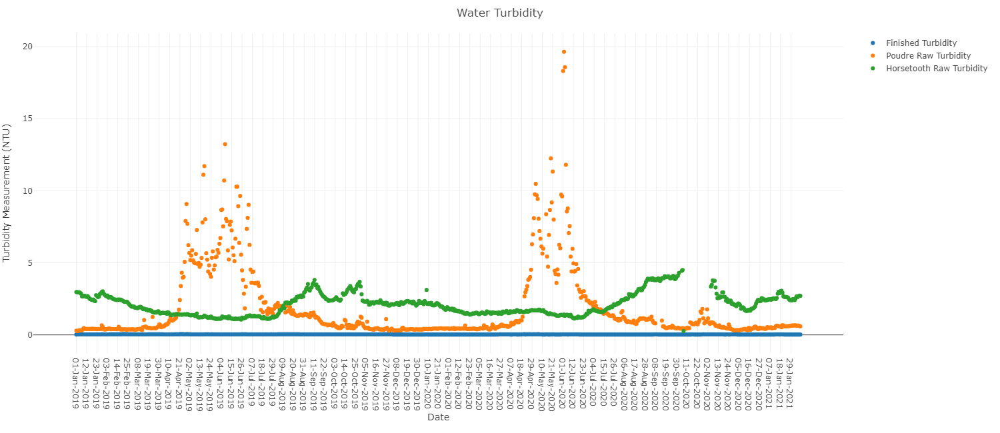
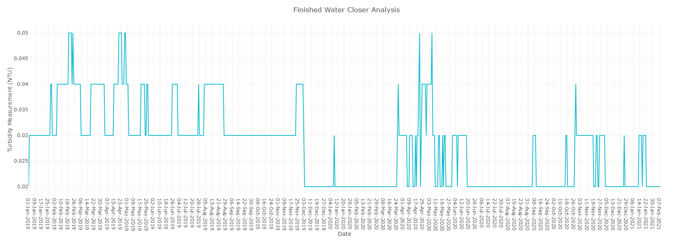
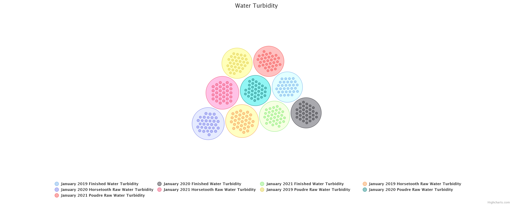

# Background
Fort Collins, CO is known to have one of the best quality water overall. The water plant, as any other should, publicly displays their data and updates it daily so people can see if the water plant is keeping the drinking water up to standard. What determines the quality of water? In order to determine how the water quality is, the turbidity of the water has to be analyzed. Turbidity is essentially the clarity of the solution (water) and the higher the NTU, the cloudier the solution. The state of Colorado has a maximum of 1 NTU allowed each month for the finished water to be measured at. The data from the water plant was extracted using an API token, instead of directly downloading the csv file.

# First Chart
The first chart depicts the turbidity measured for both the raw water source and finished water over the course of two full years a couple of months, updated daily as the data is updated by the water plant. 

The chart shows the two raw water sources: Poudre and Horsetooth, as well as the finished water. The high turbidity levels are typically seen in raw water sources as the water is from nature and contains minerals that are found in mud and aquatic life. There is a gap in the chart, which is fine since the raw water isn't the one that the water plant is worried about the standards. The data contains a few high peaks in the raw water around early spring. This is due to the snow melt from the winter months and the water runoff combining with the raw water sources. As mentioned, the high turbidity in the raw water is fine as long as the filtered water doesn't end up high as well.

# Second Chart
A line chart was used for the finished water data alone because the visualization of it on the scatter plot just appeared as 0 through the two years of data.

Using the line chart makes the daily changes more noticeable than the scatter plot. The data never reached a value of 0.1 NTU, let alone 1 NTU, so it is safe to say that the turbidity of the finished water met the Colorado standards. This is key reason why the Fort Collins water quality is supposed to be good.

# Third Chart
A packed, split bubble chart by Highcharts was used to compare annual data of January in the years 2019, 2020, and 2021. The data contained in the bubbles are: Horsetooth raw water turbidity, Poudre raw water turbidity, and finished water turbidity; all have data from each year in their own bubble.

This chart makes it easier to see that even though the results were taken in different years, the water quality of all of the sources stayed consistent annually. If the inner bubbles varied in size, then the water would have been inconsistent. 

# Conclusion
Based on the analysis of the data obtained from the water plant's public source, it is safe to conclude that Fort Collins does indeed have great water quality. Over the course of 2 years, the finished water turbidity (cloudiness) never even reached 0.5 NTU. That means that the water plant has decent equipment since the raw water sources are filtered to the point where the finished product has essentially almost no impurities. That's one of the reasons why Fort Collins is a great city to live in.

Citation
Water Quality Control Commission. “Code of Colorado Regulations.” Code of Colorado Regulations, 1 July 2013, www.sos.state.co.us/CCR/GenerateRulePdf.do?ruleVersionId=5613&fileName=5%20CCR%201002-11.
